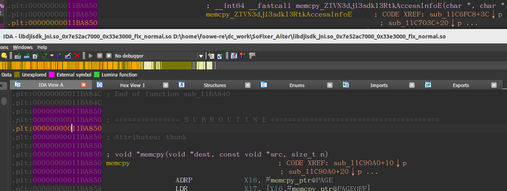
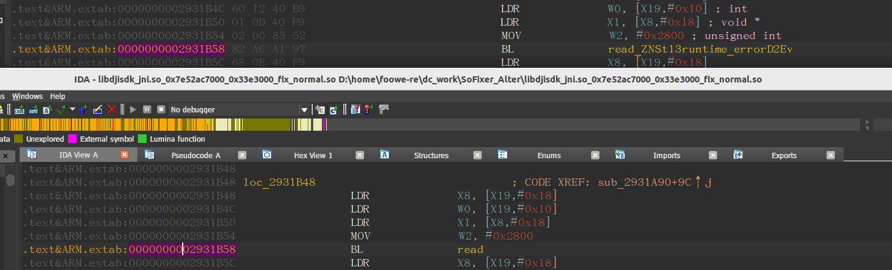
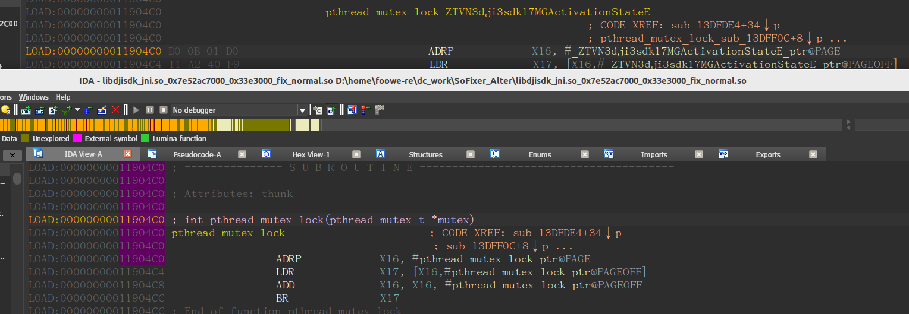

## 修复简记

修复的过程主要针对 ElfRebuilder.cpp 中的 relocate 函数。

```C++
    switch (type) {
        // I don't known other so info, if i want to fix it, I must dump other so file
        case R_386_RELATIVE:
        case R_ARM_RELATIVE:
            *prel = *prel - dump_base;
            break;
        case 0x401:
        case 0x402:{
            auto syminfo = si.symtab[sym];
            if (syminfo.st_value != 0) {
                *prel = syminfo.st_value;
            } else {
                auto load_size = si.max_load - si.min_load;
                if (mImports.size() == 0){
                  *prel = load_size + external_pointer; 
                  external_pointer += sizeof(*prel);//修复前都是从这里修改重定位内容
                }else{
                    //修复后是从这里修改重定位内容
                  const char* symname = si.strtab + syminfo.st_name;
                  int nIndex = getIndexOfImports(symname);
                  if (nIndex != -1){
                    *prel = load_size + nIndex*sizeof(*prel);
                  }
                  printf("type:0x%x offset:0x%x -- symname:%s nIndex:%d\r\n", type, rel->r_offset, symname, nIndex);
                }
            }
            break;
        }
        default:
            break;
    }
```

从打印的属性和符号名来看，0x401是导入变量符号类型，0x402是导入的函数符号类型。这里将 case 0x401 也加上了，不过不加的话，在对应的偏移出好像也能解析出对应符号，原程序中是没有加的。IDA中解析导入表时，是按照导入表顺序，逐个创建一个函数声明（每个占用8字节），SoFixer 中修改导入表时，是按照读到的重定位表中导入符号顺序，逐个加8字节（ sizeof(*prel) == 8 ）递增赋值。读到的重定位表中导入符号顺序和导入表的顺序大部分相同，但也会有些出路，所以当导入符号数量大的时候，就会对应不上。

这里修复的方法是先将导入符号名按顺序保存到 vector 中，修复时，根据重定位处读到的对应的符号名到 vector 中取数组索引，这样就能保证和导入符号的顺序完全一致。

```
int ElfRebuilder::GetIndexOfImports(std::string stringSymName){
  int nIndex = 0;
  for (auto& it : mImports){
    std::string strImport = it;
    if (strImport == stringSymName){
      return nIndex;
    }
    nIndex++;
  }
  return -1;
}

//将导入表的符号按顺序保存在 std::vector<std::string>  mImports; 中，以便后面获得导入符号序号
void ElfRebuilder::SaveImportsymNames(){
  Elf_Sym* symtab = si.symtab;
  const char* strtab = si.strtab;
  int nIndex = 0;
  bool start = false;
  while (true){
    Elf_Sym sym = symtab[nIndex];
    if (sym.st_name == 0 && !start){
      nIndex++;
      continue;
    }
    start = true;
    if (sym.st_name != 0 && sym.st_value!=0){
      //开始进到非导入表的符号，退出
      break;
    }
    const char* symname = strtab + sym.st_name;
    mImports.push_back(symname);
//    FLOGD("NO:%d %s \r\n", nIndex, symname);
    nIndex++;
  }
}
```
修复效果如下：

图 1（截图中上半部分是之前手动做的修改，下半部分是自动修复的结果，关注黄色显亮部分的函数名）




图2 （截图中上半部分是之前手动做的修改，下半部分是自动修复的结果，关注黄色显亮部分的函数名）




图3 （截图中上半部分是之前手动做的修改，下半部分是自动修复的结果，关注黄色显亮部分的函数名）

